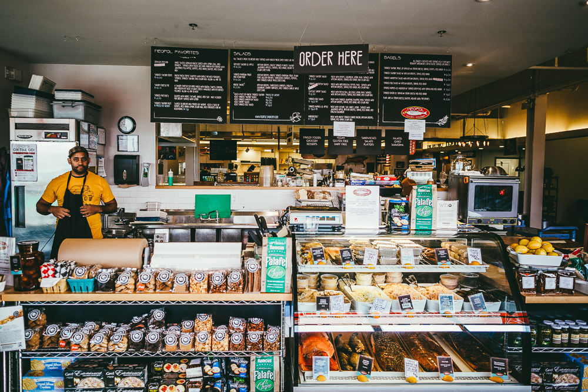
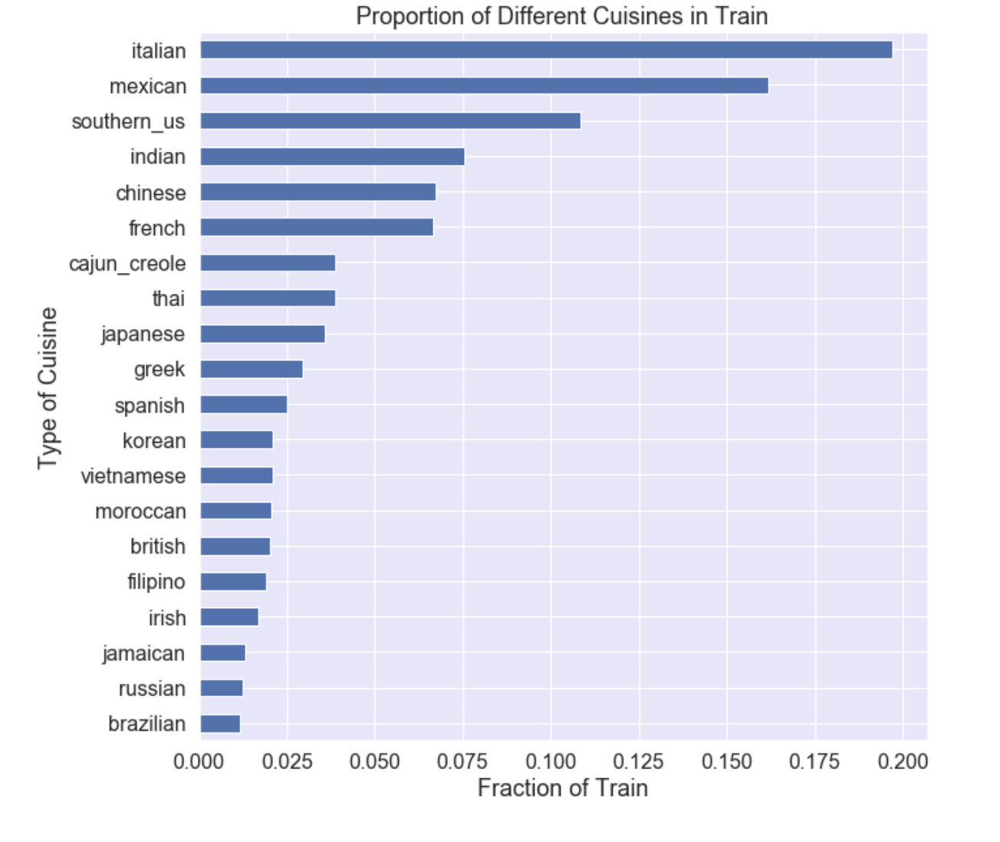
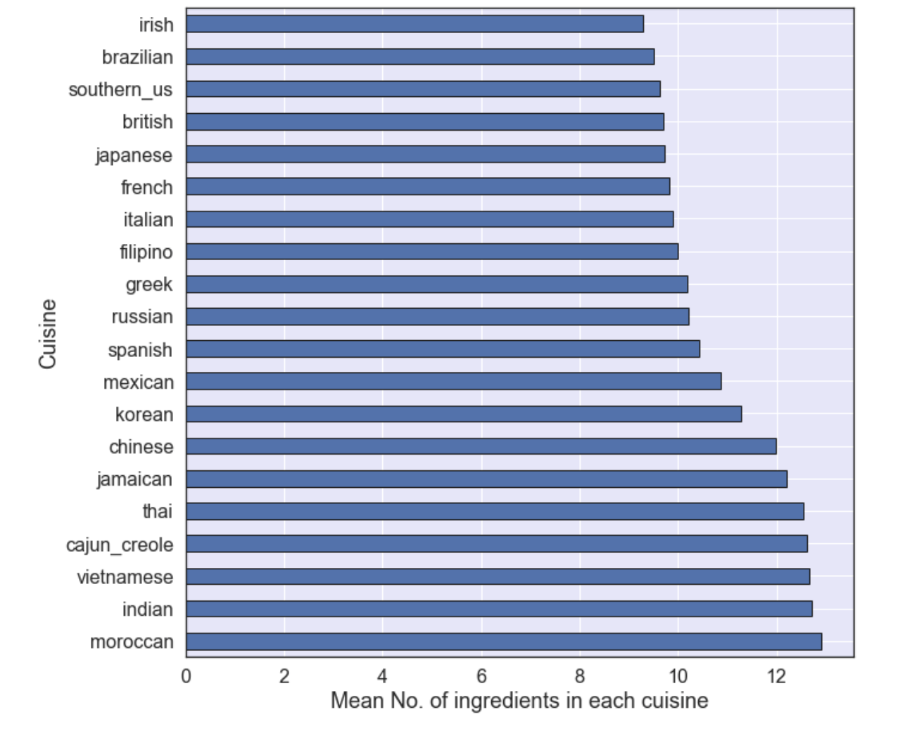
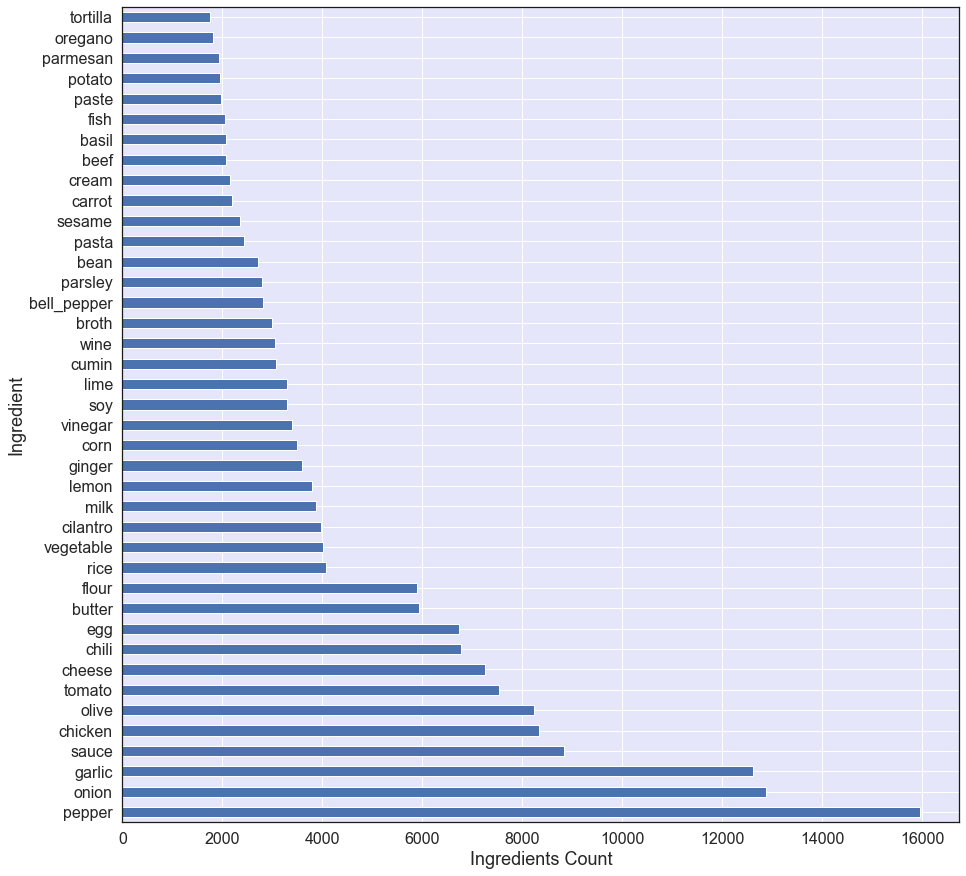
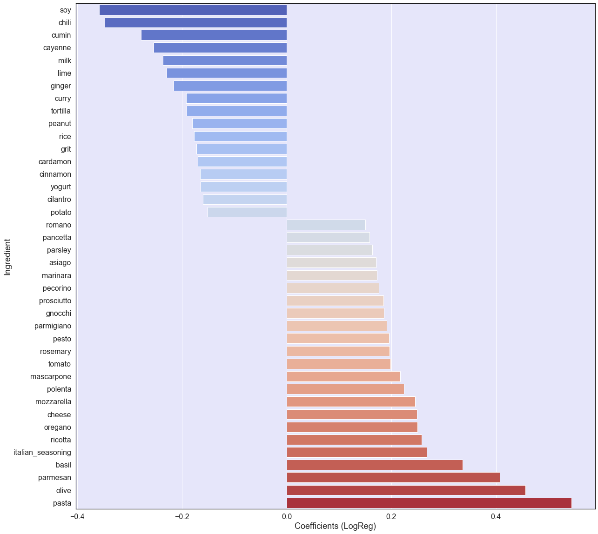

# Natural Language Processing and Multi-Classification

---

## Problem Statement

Picture yourself strolling through your local, open-air market... What do you see? What do you smell? What will you make for dinner tonight? If you're in Northern California, you'll be walking past the inevitable bushels of leafy greens, spiked with dark purple kale and the bright pinks and yellows of chard. Across the world in South Korea, mounds of bright red kimchi greet you, while the smell of the sea draws your attention to squids squirming nearby. India’s market is perhaps the most colorful, awash in the rich hues and aromas of dozens of spices: turmeric, star anise, poppy seeds, and garam masala as far as the eye can see. Some of our strongest geographic and cultural associations are tied to a region's local foods. This analysis focuses on using natural language processing and classification to predicts the category of a dish's cuisine given a list of its ingredients. The workflow includes EDA and cleaning, instantiating and fitting models, and evaluating those models.

---
## Dataset

| Topic | Description | type |
| --- | --- | --- |
| Data | in data folder | [Link](./data/)
|Cuisine| style or method of cooking | string |
|Ingredients| list of all ingredients in the food | list of strings |

---

## Workflow

1. Importing dataset from the data folder, investigating it, and converting it from json into a usable format.
2. Performing basic text data EDA.   
3. Using CountVectorizer library to create a bag of ingredients.
4. Create a list of customized stopwords and add it the imported ENGLISH_STOP_WORDS library.
5. Using sklearn and TensorFlow build out Classification models to predict category of a dish's cuisine given a list of its ingredients.
6. Evaluating the performance of different models on test set using f1 score from classification_report
7. Iteratively working on improving the models’ performance 
---

## Results

The following picture shows the distribution of different cuisines in our dataset. More than 30\% of our dataset consist of Italian and Mexican foods. Brazilian, Russian, and Jamaican cuisines have the lowest distribution in our dataset.

Some cuisines require more ingredients in their food than others. Below shows the average number of ingredients in each cuisine. Moroccan and Indian food use in average 13 items in their food; however, Irish or Brazilian cuisine needs 9 items.

After cleaning the data and creating a bag of ingredients, the following picture shows the top 40 ingredients in the dataset. Not surprisingly, pepper, onion, and garlic are the most frequent items in each cuisine and may not be the best differentiators, they were added to the stopwrods during the iterative process to improve the models score.

The following table shows the performance of different models. The hero of the models is logistic regression. Although, the NN model score similar to the Logistic Regression model, the LR model may be a better option because it is faster to train, and its coefficients are easier to interpret. The last picture shows the top 40 coefficients of Logistic Regression.

| Model | F1 Score (Test) |
| --- | --- |
| Logistic Regression |0.75|
|Random Forest|0.60|
|KNN|0.64|
|SVM|0.71| 
|Neural Network| 0.75| 

---

